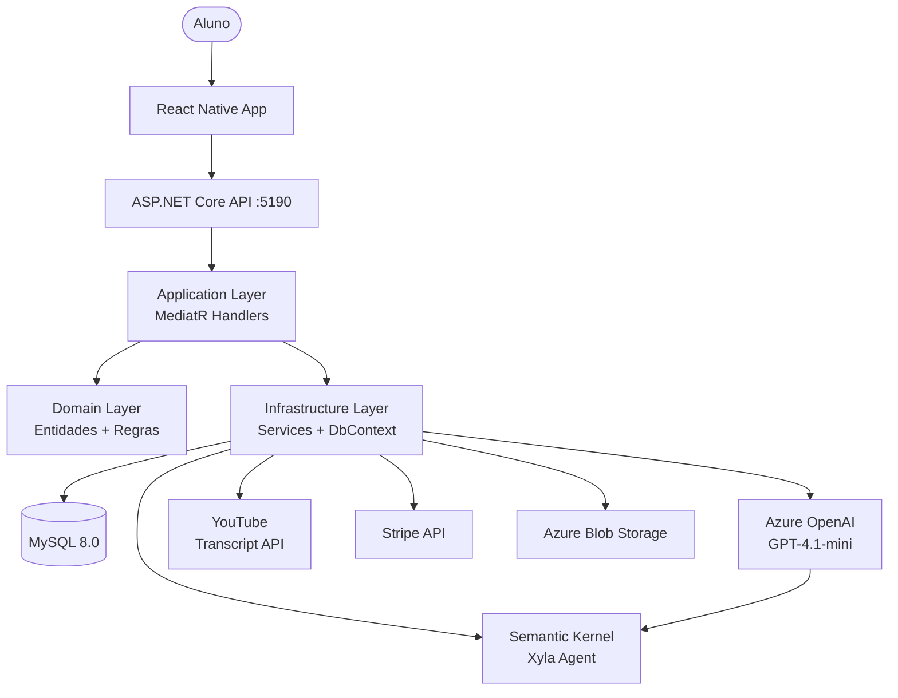

# Architecture.md
# Inglixy — Documentação de Arquitetura Real

> Documento gerado a partir da análise do código fonte existente.
> Separa claramente **estado atual** de **recomendações**.
> Atualizado: Junho 2026

---

## 1. Visão Geral do Inglixy

**Inglixy** é um aplicativo mobile de ensino de inglês para brasileiros.

**Fluxo principal:**
1. Aluno cria conta
2. Passa por entrevista com a IA Xyla (ou pula para nível A1 padrão)
3. Sistema monta uma unidade com vídeo + 50 questões do catálogo
4. Aluno assiste ao vídeo e responde questões estilo Duolingo
5. Progresso é rastreado; revisão via flashcards

**Tech Stack (verificado no código):**
- Mobile: React Native + Expo + TypeScript
- Backend: .NET 9 + ASP.NET Core + C#
- Database: MySQL 8.0 (Pomelo EF Core)
- AI: Azure OpenAI GPT-4.1-mini + Semantic Kernel
- Auth: JWT + Refresh Tokens
- Logging: Serilog
- Mediação: MediatR
- Pagamentos: Stripe
- Storage: Azure Blob Storage
- Email: (interface IEmailService — implementação não identificada no projeto)
- Push: FCM via INotificationService

---

## 2. Arquitetura em Alto Nível

